# paper-grade-copilot

# AI-Driven Paper Manufacturing Grade Transition Copilot

An AI-powered decision support system that predicts paper quality during grade transitions and recommends optimal process parameter settings to minimize off-spec production.

This project was developed as an end-to-end Machine Learning application for intelligent paper manufacturing process optimization. It combines predictive analytics, recommendation generation, and an interactive dashboard to assist operators in making data-driven decisions during paper grade transitions.

---

# Project Overview

During paper manufacturing, changing from one paper grade to another is one of the most critical production stages. Improper machine settings during transitions can produce off-spec paper, increase raw material wastage, reduce productivity, and increase production costs.

The AI-Driven Paper Manufacturing Grade Transition Copilot predicts future Basis Weight, estimates the probability of off-spec production, and recommends process parameter adjustments to improve production stability.

---

# Features

- Predict Future Basis Weight using XGBoost Regression
- Predict Off-Spec Risk using XGBoost Classification
- AI-based Recommendation Engine
- Historical Stabilization Evidence
- Interactive Dashboard
- Real-time Prediction API
- Process Monitoring Dashboard
- Historical Recommendation Viewer
- REST API using Flask
- Interactive Charts using Chart.js
- Responsive HTML/CSS/JavaScript Frontend

---

# Objectives

- Reduce off-spec paper production
- Improve grade transition stability
- Assist operators with AI recommendations
- Predict future paper quality before defects occur
- Reduce production losses
- Improve manufacturing efficiency

---

# Technology Stack

## Machine Learning

- Python
- Pandas
- NumPy
- Scikit-learn
- XGBoost
- Joblib

## Backend

- Flask
- Flask-CORS

## Frontend

- HTML5
- CSS3
- JavaScript
- Chart.js

## Data Processing

- Pandas
- NumPy

---

# Project Architecture

```
Raw Dataset
      │
      ▼
Stage 1
Data Cleaning & Preprocessing
      │
      ▼
Stage 2
Feature Engineering
      │
      ▼
Stage 3
Basis Weight Prediction Model
(XGBoost Regression)
      │
      ▼
Stage 4
Off-Spec Prediction Model
(XGBoost Classification)
      │
      ▼
Stage 5
AI Recommendation Engine
      │
      ▼
Stage 6
Historical Stabilization Evidence
      │
      ▼
Stage 7
Flask Dashboard + REST API
```

---

# Machine Learning Pipeline

## Stage 1

Data Cleaning

- Missing value handling
- Data validation
- Data preprocessing
- Feature normalization

---

## Stage 2

Feature Engineering

Generated engineered features including:

- Position Features
- Ratio Features
- Basis Weight Error
- Basis Weight Error Direction
- Grade Change Indicator
- Transition Phase Encoding
- Operator Adjustment Flag
- Process Change Features

---

## Stage 3

Future Basis Weight Prediction

Algorithm:

- XGBoost Regressor

Target

```
future_basis_weight_5min
```

Output

Predicted paper basis weight after 5 minutes.

---

## Stage 4

Future Off-Spec Prediction

Algorithm

- XGBoost Classifier

Target

```
future_off_spec
```

Output

- Safe
- Off-Spec

---

## Stage 5

AI Recommendation Engine

The recommendation engine:

- Generates candidate operating conditions
- Predicts future basis weight
- Calculates deviation
- Selects minimum process adjustment
- Provides operator recommendations

---

## Stage 6

Historical Stabilization Evidence

Provides:

- Historical successful transitions
- Similar grade changes
- Previous stabilization examples
- Supporting process evidence

---

## Stage 7

Interactive Dashboard

Dashboard Modules

- Current Process
- Live Prediction
- AI Recommendations
- Historical Evidence
- Dataset Summary
- Prediction Charts

---

# Project Structure

```
Paper-Grade-Transition-Copilot/

│
├── app/
│   └── app.py
│
├── data/
│   ├── raw/
│   └── processed/
│
├── models/
│   ├── basis_weight_xgboost.pkl
│   └── off_spec_xgboost.pkl
│
├── reports/
│   └── model_results/
│
├── scripts/
│   ├── 01_data_preprocessing.py
│   ├── 02_feature_engineering.py
│   ├── 03_train_basis_weight_model.py
│   ├── 04_train_offspec_model.py
│   ├── 05_recommendation_engine.py
│   ├── 06_stabilization_evidence.py
│   └── 07_flask_dashboard.py
│
├── static/
│   ├── style.css
│   └── script.js
│
├── templates/
│   └── index.html
│
├── requirements.txt
│
└── README.md
```

---

---

# Project Screenshots

## AI Dashboard Interface

The interactive dashboard provides real-time monitoring, prediction results, AI recommendations, and historical stabilization evidence.

### Main Dashboard

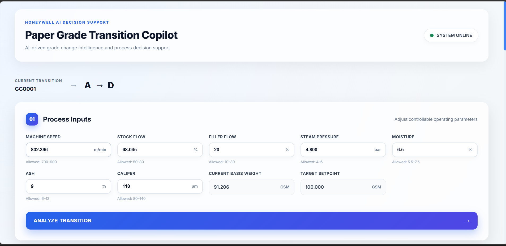


### Live Prediction Module

The prediction module displays:

- Future Basis Weight Prediction
- Off-Spec Risk Probability
- Process Stability Status
- Current Process Parameters

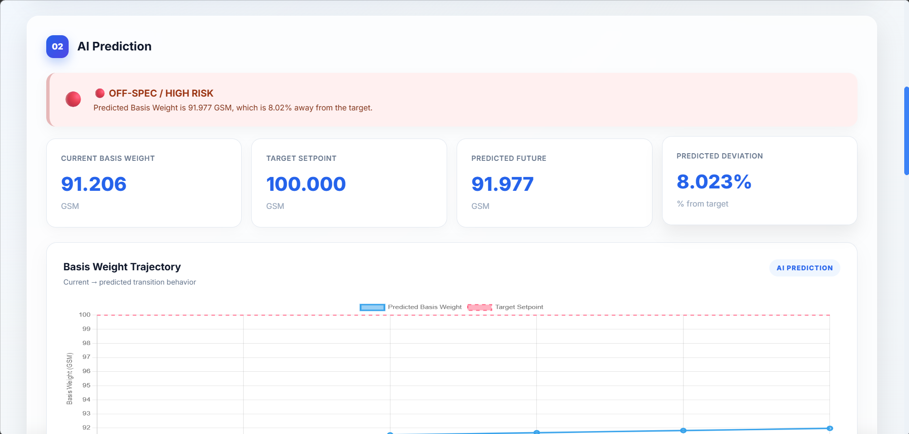

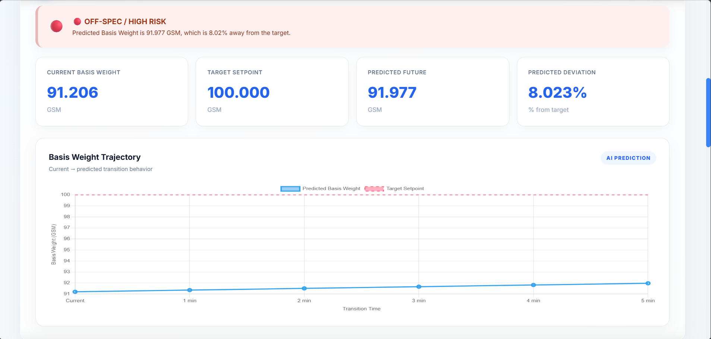
### AI Recommendation Engine

The recommendation engine suggests optimal process parameter adjustments to minimize deviation and maintain production stability.

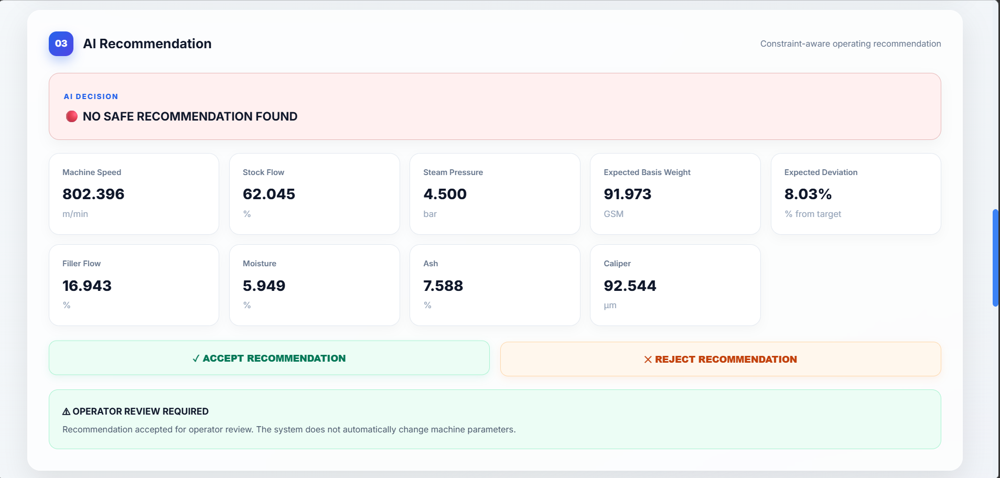

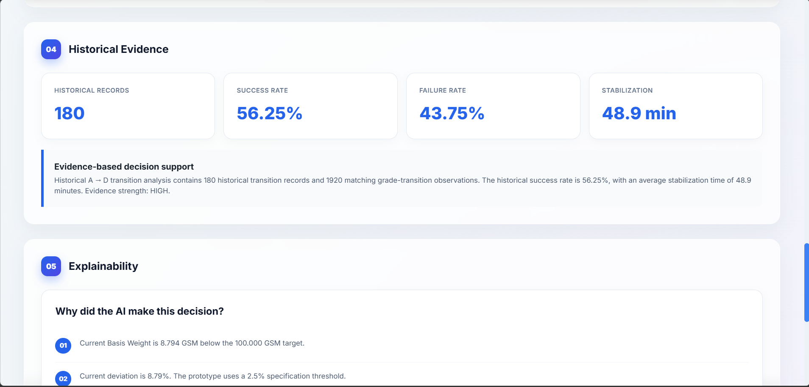


### Historical Stabilization Evidence

The system provides previously successful transition examples to support operator decisions.

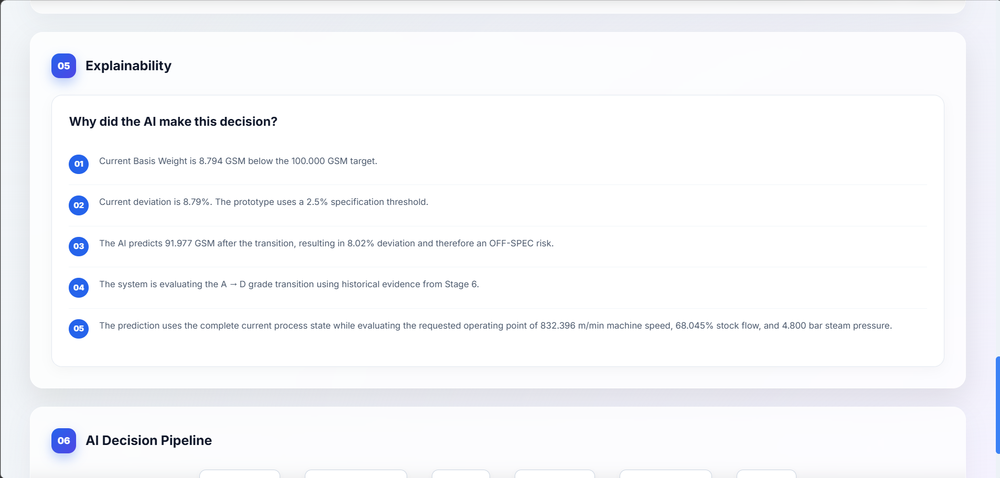

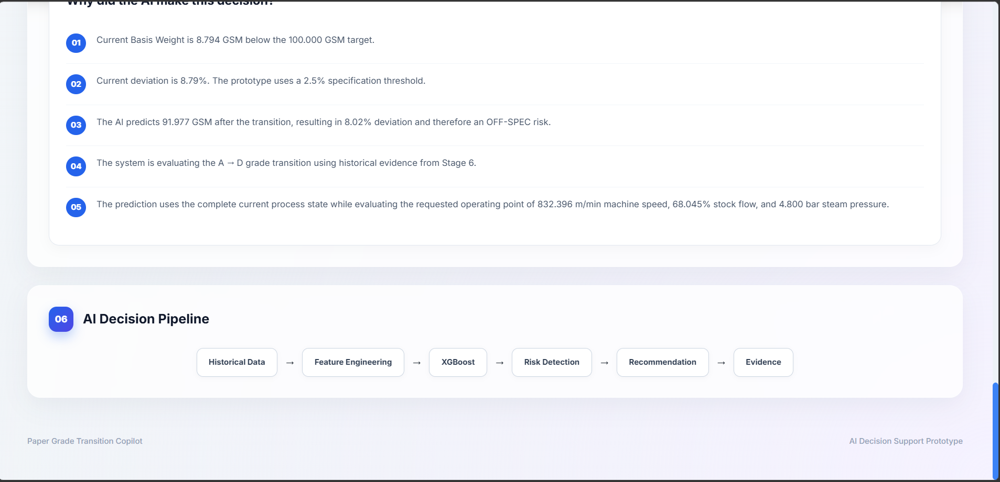
---

---

# Data Analysis & Model Visualization

The project includes detailed exploratory data analysis, prediction analysis, and explainable AI visualizations to understand the factors affecting paper grade transitions.

---

## Exploratory Data Analysis (EDA)

### Basis Weight Distribution

Shows the distribution of paper basis weight values across production data.

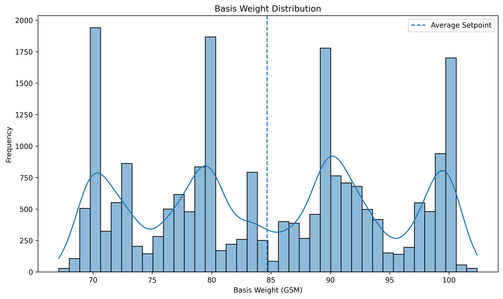


### Basis Weight Deviation Analysis

Analyzes deviation between actual basis weight and target setpoint during production.

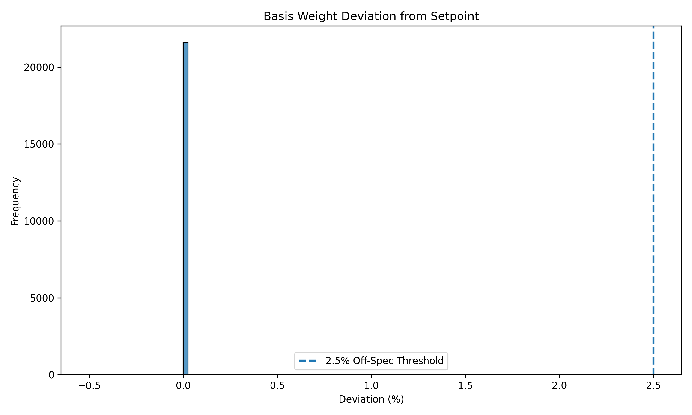


### Deviation Distribution

Shows the frequency distribution of basis weight deviations.

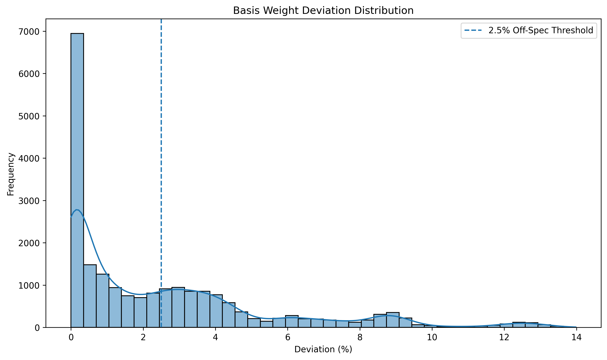


### Process Variable Correlation Heatmap

Displays relationships between manufacturing process parameters and quality variables.

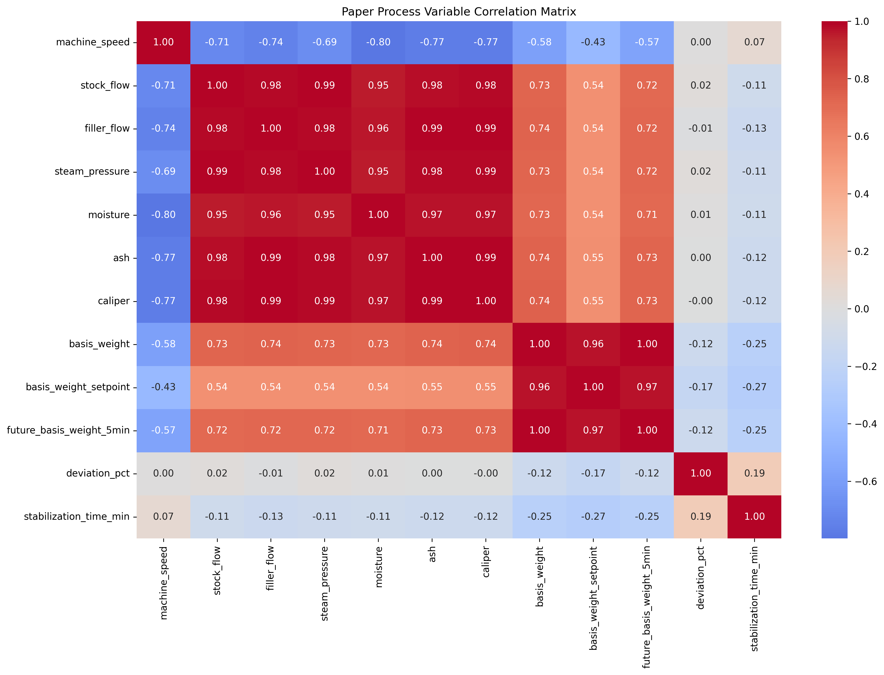

---

# Prediction Analysis

## Future Basis Weight vs Setpoint

Comparison between predicted future basis weight and desired operating setpoint.

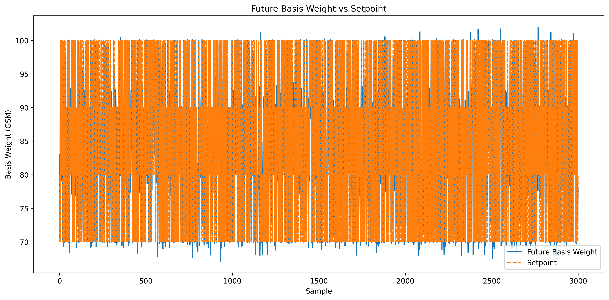


## Off-Spec Probability Distribution

Shows the probability distribution of production moving towards off-spec conditions.

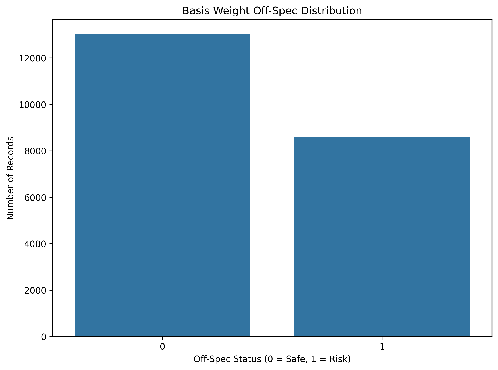

---

# Explainable AI (XAI) Analysis

The system uses SHAP-based explainability to understand how process parameters influence AI predictions.

## SHAP Feature Importance

Identifies the most influential process variables affecting paper quality prediction.

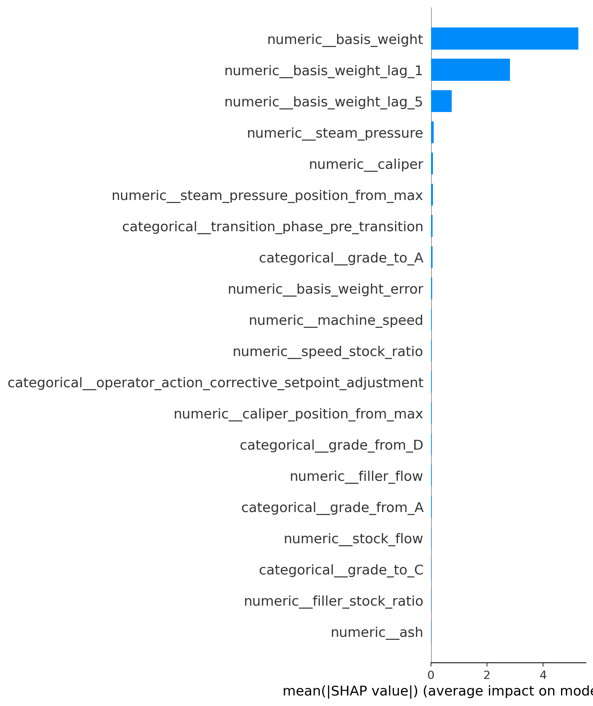


## SHAP Summary Analysis

Provides detailed feature impact visualization for model decisions.

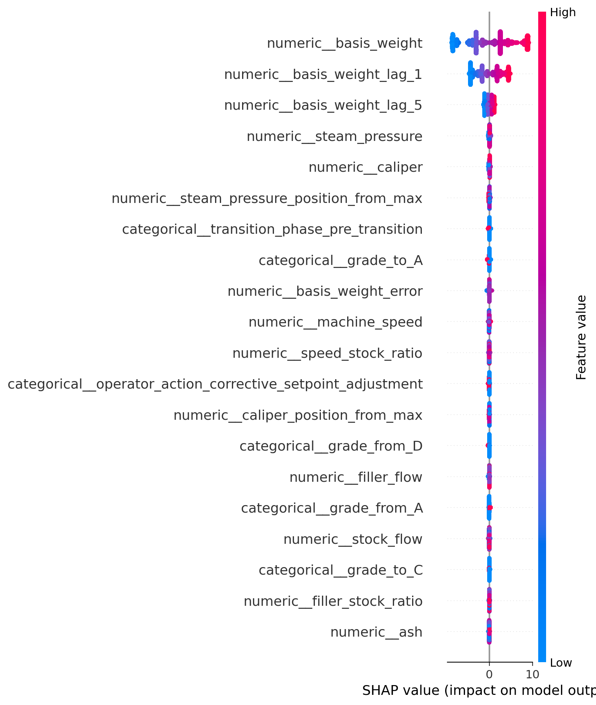

---

# Stabilization Analysis

## Production Stabilization by Outcome

Analyzes historical transition outcomes and identifies successful stabilization patterns.

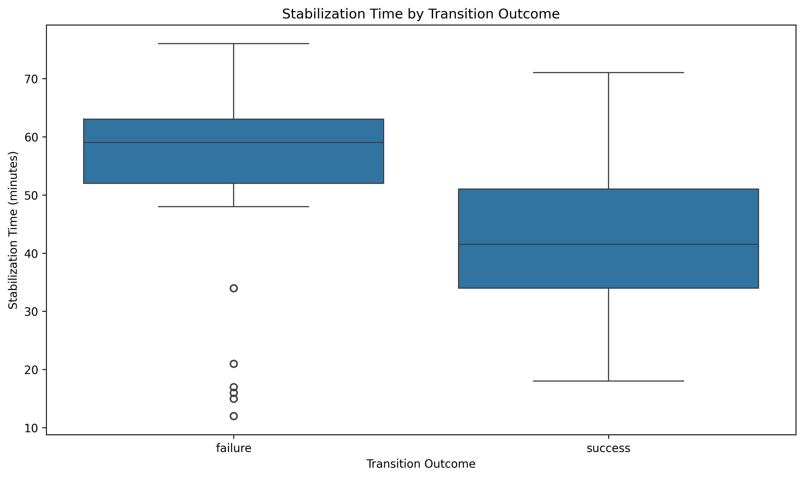

---

# Process Variables

The AI system monitors the following controllable process parameters:

- Machine Speed
- Stock Flow
- Filler Flow
- Steam Pressure
- Moisture
- Ash
- Caliper

---

# API Endpoints

## Health Check

```
GET /api/health
```

---

## Dashboard Summary

```
GET /api/dashboard
```

---

## Dataset Summary

```
GET /api/summary
```

---

## Current Process

```
GET /api/current-process
```

---

## Prediction

```
POST /api/predict
```

---

## Recommendations

```
GET /api/recommendations
```

---

## Historical Evidence

```
GET /api/evidence
```

---

# Prediction Output

The prediction API returns:

- Predicted Basis Weight
- Predicted Deviation
- Off-Spec Prediction
- Off-Spec Probability
- Process Status
- Current Inputs

---

# AI Recommendation Engine

The recommendation engine evaluates multiple operating conditions within allowable process limits.

For every candidate, it calculates:

- Future Basis Weight
- Predicted Deviation
- Off-Spec Status
- Change Penalty

The engine recommends the operating condition with:

- Lowest predicted deviation
- Minimum process adjustment
- Highest production stability

---

# Dashboard Features

- Modern Responsive UI
- Interactive Charts
- Current Process Monitoring
- Live Prediction
- AI Recommendation Table
- Historical Evidence
- System Status
- Process Summary

---

# Installation

Clone the repository

```bash
git clone https://github.com/yourusername/paper-grade-transition-copilot.git
```

Go inside the project

```bash
cd paper-grade-transition-copilot
```

Install dependencies

```bash
pip install -r requirements.txt
```

Run Flask

```bash
python app.py
```

Open browser

```
http://127.0.0.1:5000
```

---

# Model Performance

## Basis Weight Prediction

Model

- XGBoost Regressor

Output

Future Basis Weight Prediction

---

## Off-Spec Prediction

Model

- XGBoost Classifier

Output

Binary Classification

- Safe
- Off-Spec

---

# Future Improvements

- Reinforcement Learning based control optimization
- Live PLC/SCADA integration
- MQTT based real-time communication
- Digital Twin integration
- Explainable AI (SHAP)
- Multi-machine deployment
- Cloud deployment
- Operator authentication
- Production report generation

---

# Applications

- Paper Manufacturing
- Smart Manufacturing
- Industrial AI
- Process Optimization
- Industry 4.0
- Manufacturing Analytics
- Quality Prediction
- Decision Support Systems

---

# License

This project is developed for educational, research, and demonstration purposes.

---

# Author

**Jiya Singh**

B.Tech Computer Science Engineering

VIT Bhopal University

AI | Machine Learning | Data Science | Full Stack Development

---

# Acknowledgements

Special thanks to:

- Honeywell Industrial Automation
- Open Source Python Community
- Scikit-learn
- XGBoost
- Flask
- Chart.js

---

## Project Status

**Completed**

End-to-end AI-powered Paper Grade Transition Copilot with Machine Learning models, Recommendation Engine, Historical Evidence System, REST APIs, and Interactive Dashboard.